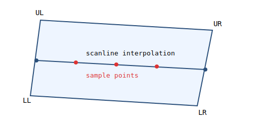

# How Resampling Works Against Target Tiles

This document explains how `geotiff-to-pmtiles` resamples source raster pixels into output web map tiles.

It follows the current code as closely as possible, while simplifying details so you can implement a toy version yourself.

Relevant code paths:

- `src/convert/mod.rs`
- `src/convert/render.rs`
- `src/convert/source.rs`
- `src/resample/georef.rs`
- `src/resample/types.rs`
- `src/resample/nodata.rs`

## Big Picture

The renderer does not iterate source pixels and "paint" onto tiles.

Instead, it iterates each **target tile pixel**, maps that pixel back to source raster space, and samples source values.

```
[target tile z/x/y, pixel i/j]
          |
          v
 tile pixel -> WebMercator (EPSG:3857)
          |
          v
    source CRS (EPSG:xxxx)
          |
          v
 source raster pixel coordinate (x, y)
          |
          v
 nearest or bilinear sampling (+ nodata handling)
```

This is the core "inverse mapping" approach.

## Step 1: Decide min zoom and tile coverage

### 1.1 Read metadata and georeferencing

For each input file, the tool reads:

- raster width/height
- georeference transform (GeoTIFF tags or world file fallback)
- source CRS

Main functions:

- `read_georef()` in `src/resample/georef.rs`
- `load_source_metadata()` in `src/resample/inputs.rs`

Georeference priority in `read_georef()`:

1. `ModelTransformationTag`
2. `ModelPixelScaleTag + ModelTiepointTag`
3. adjacent world file (`.tfw`, `.TFW`, `.tifw`, `.TIFW`)

A small but important detail is `raster_offset` (`0.0` or `-0.5`) for PixelIsArea vs PixelIsPoint/world-file semantics (`src/resample/georef.rs`).

### 1.2 Convert source image corners to Web Mercator

`source_corners_merc_georef()` (`src/resample/georef.rs`) does:

1. Build four raster corners in pixel space.
2. Apply source geotransform (`GeoTransform::apply()`).
3. Reproject from source CRS to `EPSG:3857`.

Now every source has corners in one common coordinate space (Web Mercator), so tile math is straightforward.

### 1.3 Compute auto min zoom

In `convert()` (`src/convert/mod.rs`), all source corners are unioned into one extent:

- `min_x_merc`, `max_x_merc`, `min_y_merc`, `max_y_merc`

Then base zoom is chosen with:

- `zoom_for_tile_size((extent_width).max(extent_height))` in `src/resample/types.rs`

`zoom_for_tile_size()` searches from high zoom down and returns the first zoom where one tile edge is large enough to cover the required size.

Toy formula:

```text
world_size = 2 * ORIGIN_SHIFT
tile_size(z) = world_size / 2^z
pick largest z such that tile_size(z) >= required_extent_size
```

So the selected `min_zoom` is usually the coarsest zoom where the data still fits in a small number of tiles.

### 1.4 Enumerate covering tiles

For each zoom `z` (from `min_zoom` to `max_zoom`), `convert()`:

1. Maps Mercator bbox corners to tile indices via `webmerc_to_tile()`.
2. Builds an inclusive tile range (`x_min..x_max`, `y_min..y_max`).
3. Skips empty tiles with a bbox intersection test against each source bbox.

Functions:

- `webmerc_to_tile()` in `src/resample/types.rs`
- `tile_bounds_webmerc()` in `src/resample/types.rs`

## Step 2: Project tile corners to source raster and interpolate per pixel

For each tile `(z, x, y)`:

1. Compute tile corners in Web Mercator with `tile_bounds_webmerc()`.
2. For each intersecting source, map those tile corners into that source raster coordinates with `tile_corners_in_georef_raster()`.

`tile_corners_in_georef_raster()` (`src/resample/georef.rs`) does:

- `EPSG:3857` -> source CRS reprojection
- apply inverse geotransform (`GeoTransform::invert()` + `apply()`) to get raster-space corner coordinates

So for each source and tile, you get four points in raster pixel space:

- UL, UR, LR, LL (not necessarily axis-aligned)

### 2.1 Per-pixel interpolation inside the tile

Inside `render_tile_chunked()` (`src/convert/render.rs`), each output tile is rendered as `512 x 512` pixels.

For each output row `j`:

1. `v = j / (TILE_SIZE - 1)`
2. Interpolate left and right raster points on tile edges:
   - `left = lerp(UL, LL, v)`
   - `right = lerp(UR, LR, v)`
3. Compute per-column increments:
   - `dx = (right.x - left.x) / (TILE_SIZE - 1)`
   - `dy = (right.y - left.y) / (TILE_SIZE - 1)`
4. Walk across columns by repeated addition (`x += dx`, `y += dy`).

This means each output pixel `(i, j)` gets a source-space floating coordinate `(x, y)`.

- corners are projected tile corners in source raster coordinates
- each row is interpolated from left edge to right edge
- each * is a sampled source coordinate for a target pixel



## Step 3: Sample nearest or bilinear, including nodata

The sampling decision lives in `src/convert/render.rs`.

### 3.1 Nearest

Function chain:

- `sample_nearest_multi()`
- `sample_nearest_with_dist()`

Behavior:

1. Around floating `(x, y)`, build 2x2 integer candidates:
   - `(floor x, floor y)`, `(floor x + 1, floor y)`, `(floor x, floor y + 1)`, `(floor x + 1, floor y + 1)`
2. Sort by squared distance to `(x, y)`.
3. For each candidate:
   - skip if out of bounds
   - skip if nodata
   - first valid one is returned for that source
4. Across multiple sources, choose the globally nearest valid candidate.

If nothing is valid, output is transparent `[0, 0, 0, 0]`.

### 3.2 Bilinear

Function chain:

- `sample_bilinear_multi()`
- `sample_bilinear_opt()`

Behavior:

1. Use the same 2x2 neighbors around `(x, y)`.
2. Compute bilinear weights from `tx` and `ty`.
3. Ignore neighbors that are out of bounds or nodata.
4. Accumulate weighted RGBA and renormalize by `wsum`.

Important detail: if some neighbors are invalid, weights are renormalized over only valid neighbors.

If `wsum == 0` (all invalid), sample is `None`.

Across multiple sources, bilinear policy is different from nearest:

- first source in input order that yields a valid bilinear sample wins.

### 3.3 Nodata behavior

`--nodata` parsing is in `src/resample/nodata.rs`:

- one value: grayscale (e.g. `0`)
- three values: RGB (e.g. `255,255,255`)

`NoDataSpec::is_nodata()` checks RGB channels only.

When a sampled pixel matches nodata:

- it is excluded from nearest/bilinear candidate sets
- if no valid sample remains, output becomes transparent `[0,0,0,0]`

This "skip invalid then renormalize" approach is a robust default for toy implementations too.

## Toy Implementation Checklist

If you want to build a simplified clone, keep just this:

1. Read source raster + geotransform + CRS.
2. Reproject source corners to `EPSG:3857`.
3. Pick base zoom from extent size.
4. For each target tile, compute Mercator corners.
5. Reproject tile corners back to source raster space.
6. For each output pixel, interpolate source `(x, y)` on scanlines.
7. Sample nearest or bilinear with nodata-aware skipping.
8. Write RGBA tile (PNG is fine for a toy).

Pseudo-code sketch:

```text
for each tile:
  corners_src = project_tile_corners_to_source_raster(tile)
  for j in 0..tile_size:
    v = j/(tile_size-1)
    left  = lerp(UL, LL, v)
    right = lerp(UR, LR, v)
    x, y = left
    dx, dy = (right-left)/(tile_size-1)
    for i in 0..tile_size:
      out[j][i] = sample(source, x, y, method, nodata)
      x += dx
      y += dy
```

That core loop is the essence of this crate's tile resampling logic.
